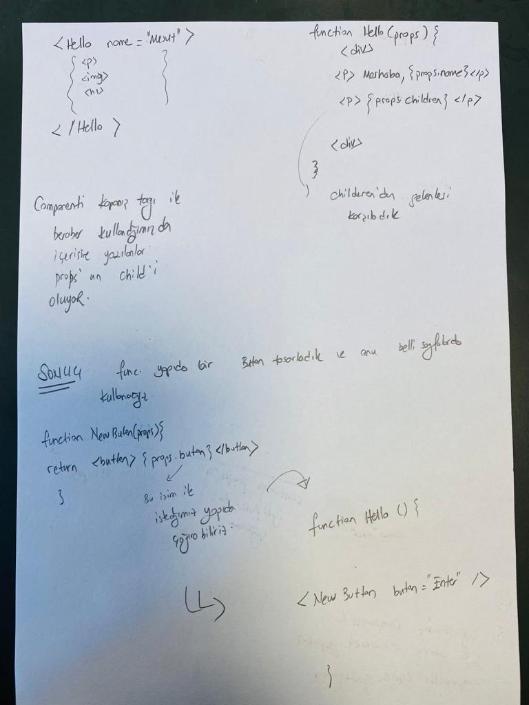

# Components and Props





```
import React from 'react'

const Form = (props) => {
  return (
    <div>Form

<button>{props.formbuton}</button>


    </div>
  )
}

export default Form


sayfasında kullandığımız props u App.js içinde import ederek kullanabiliyoruz.

App.js =>


 <Form formbuton="back"/>

```